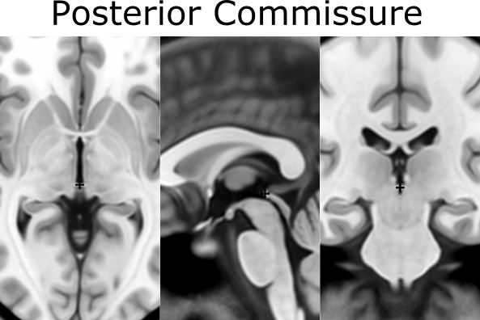
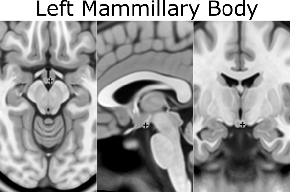
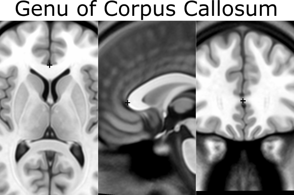
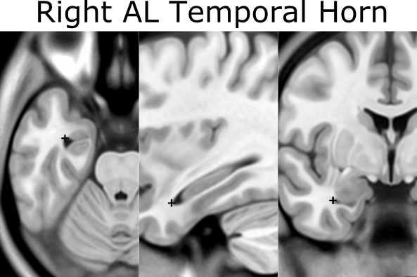
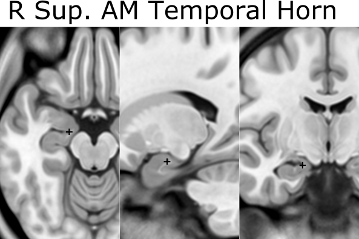
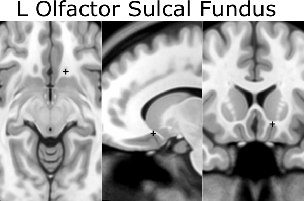

==============
AFIDS Protocol
==============

Preparation
-----------
* Download and use [Slicer 4.10.2](https://download.slicer.org/)

Naming Scheme for Fiducial Files
--------------------------------
* [VolumeID]_[Contrast]_[Rater]_[N] (e.g. MNI2009b_T1_JL_1_20170511.fcsv)

  * **[VolumeID]** = the identifier for the volume on which you are performing the fiducial placements; for the tutorial it will be one of the well known MRI templates:
    * Colin27: average of 27 Colin brains
    * MNI2009b: average of 152 healthy controls 
    * Agile12v1.0: average of 12 healthy controls at 7T
  * **[Contrast]** = T1, T2, PD, other (typically will be T1)
  * **[Rater]** = the unique identifier for the rater performing the fiducial placement; convention will be first initial and last name to prevent overlap
  * **[N]** = reference for fiducial placement session (helpful if performing placements more than once; starting with 1)
  * **[YYYYMMDD]** = year month and date

AC-PC Placement
---------------
Download assigned volume/template from github repository.
Go to Markups Module and create Module named **ACPC_[VolumeID]_[Rater]_[N]**. Place **AC** and **PC** landmarks:
1. AC = anterior commissure (center)
2. PC = posterior commissure (center)

Create new AC-PC transform
--------------------------
Create a new Markup list entitled Fid32_[VolumeID]_[Rater]_[N].
Create a new Markup list entitled midline.

To create a new AC-PC Transform you must place AC and PC fiducial markers in previous step. 
1. Copy AC and PC markers from ACPC to the midline list.
2. Go back to the midline list and place a fiducial marker in the infracollicular sulcus (point 3)
3. Place another fiducial marker at the Genu of CC (point 19)
4. You should now have AC and PC in the ACPC markups list and AC, PC, infracollicular sulcus and Genu of CC in the midline list
5. Under modules select Registration  Specialized  ACPC Transform. 
6. In the Transform Panel, under ACPC Line select the ACPC markups list, under Midline select the midline list, and under Output transform select Create new linear transform as… and name it Output transform
7. Click apply at the bottom of the window
8. Next under modules go to Data. Beside the image volume select the ‘eye’ icon to turn the volume back on.
9. Next under Modules go to Transforms and under Active Transform dropdown tab select the create Output transform (if not already selected). 
10. Under Apply Transform select all 4 items (i.e MNI2009b_T1w_GGl_20190801, ACPC, Midline and FID32) and transfer them to the transformed side. 

General Fiducial Placement Strategies
-------------------------------------
Use the **"Jump to Slice"** feature to center your view on the fiducial of interest and ensure that the placed landmark appears accurate 
on all three standard views (axial, sagittal, coronal). Once a fiducial is placed, **dragging** the fiducial can allow for more refined 
placement. Holding down **shift** centers the view in all views on the cursor (use along with crosshair function). If a given fiducial 
is classified as **[midline]**, jump to an existing midline fiducial (e.g. AC or PC) and start by placing the fiducial on the 
**sagittal** view and refine placement using the other views. Try to place fiducials at the **boundary/edge** of the feature of 
interest. For some of the fiducials, the instructions for placement will explicitly say to place the landmark using information mostly 
from one view (e.g. axial view for olfactory sulcus). Be aware that changing the windowing of your images (and lighting in the room) may 
affect your perception of where landmarks should be placed. When you're satisfied with the location of a fiducial, **lock it in place** 
to prevent yourself from displacing it later. **NOTE: there is no UNDO feature for fiducial placements.**

Placement of Fiducial Series
----------------------------
Create a new Markup list entitled **Fid32_[VolumeID]_[Rater]_[N]**. Click on **ACPC Line** and copy over AC and PC to your new list by 
right clicking each fiducial, choosing "Copy fiducial to another list", and selecting **Fid32_[VolumeID]_[Rater]_[N]**. Place the 
following **30 fiducials**, enter the number corresponding to the fiducial in the Name textbox and enter the underlined anatomical 
structure in the corresponding Description textbox:

When placing the fiducials make sure you are on the **Fid32_[VolumeID]_[Rater]_[N]** markup list. Click on **midline** and copy over AC, PC along with the other points to your FID32 list by selecting all fiducials, right click and choosing "Copy”. Select **Fid32_[VolumeID]_[Rater]_[N]**. Place each of the **fiducials** in the markups list entering the associated fiducial number in **Name** and enter the **underlined** name in the **Description textbox**.

1. AC [midline]
###############
* Place at the center of the commissure

.. image:: images/01_AC.png
	:align: center
	:alt: 01. Anterior Commissure

2. PC [midline]
###############
* Place at the center of the commissure

3. infracollicular sulcus [midline]
###################################
* Inferior part of sulcus of inferior colliculi at the midline junction of inferior colliculi
* Inferior most boundary of longitudinal intercollicular sulcus

.. image:: images/03_InfracollicularSulcus.png
	:align: center
	:alt: 03. Infracollicular Sulcus

4. PMJ = pontomesencephalic junction [midline]
##############################################
* At the junction but because the junction tapers off gradually, choose the ventral/inferior/pontine side of the junction using the sagittal and coronal views

.. image:: images/04_PMJ.png
	:align: center
	:alt: 04. Pontomesencephalic Junction

5. superior interpeduncular fossa [midline]
###########################################
* Most superior axial slice showing the interpeduncular fossa
* Use coronal slice to help optimize location at boundary of 3rd ventricle and surrounding brain
* Commentary: useful fiducial location for DBS since subthalamic nucleus close by

.. image:: images/05_SIPF.png
	:align: center
	:alt: 05. Superior Interpeduncular Fossa
	
6. R superior LMS = right superior lateral mesencephalic sulcus
###############################################################

* Localize using axial slices; at boundary of CSF and brain
* Use the coronal and sagittal views to optimize the location so that this point is in the angle created in all views

.. image:: images/06_RSLMS.png
	:align: center
	:alt: 06. Right Superior Lateral Mesencephalic Sulcus
	  
7. L superior LMS = left superior lateral mesencephalic sulcus
###############################################################

* As in 6

.. image:: images/07_LSLMS.png
	:align: center
	:alt: 07. Left Superior Lateral Mesencephalic Sulcus

8. R inferior LMS = right inferior lateral mesencephalic sulcus
###############################################################

* Localize at junction between midbrain and pons first using axial slices
* Refine positioning using sagittal view (at the change in angle of brainstem at the PMJ)

.. image:: images/08_RILMS.png
	:align: center
	:alt: 08. Right Inferior Lateral Mesencephalic Sulcus
  
9. L inferior LMS = left inferior lateral mesencephalic sulcus
##############################################################

* As in 8

.. image:: images/09_LILMS.png
	:align: center
	:alt: 09. Left Inferior Lateral Mesencephalic Sulcus
	
10. Culmen [midline]
####################

* Jump to AC or another midline AFID to get to the mid-sagittal slice, then place using the sagittal view
* Most superior point of cerebellar vermis; one of the vermian lobules

.. image:: images/10_culmen.png
	:align: center
	:alt: 10. Culmen
	  
11. Intermammillary sulcus [midline]
####################################

* Click to jump to AC landmark and place using the sagittal view 
* Midpoint between the mamillary bodies; remember to place at the border of the grey matter

.. image:: images/11_IMS.png
	:align: center
	:alt: 11. Intermammillary sulcus
  
12. R MB = right mammillary body
################################

* Place at the center of the mammillary body

.. image:: images/12_RMB.png
	:align: center
	:alt: 12. Right Mammillary body
	
13. L MB = left mamillary body
##############################

* As in 12

	
14. pineal gland [midline]
##########################

* Click to jump to the AC landmark on the sagittal view and place AFID in the middle of gland (use all views to correctly place this point)
* Occasionally the pineal gland is calcified, which makes it more difficult to find the center of the gland. Be sure to scroll back and forth in all views to find the true center point regardless of asymmetry of calcifications

.. image:: images/14_PG.png
	:align: center
	:alt: 14. Pineal Gland
	
15. R LV at AC = right lateral aspect of frontal horn on coronal section of AC
##############################################################################

* Defined at same coronal slice as AC (jump to it)

.. image:: images/15_RLVAC.png
	:align: center
	:alt: 15. Right Lateral Aspect of Frontal Horn on Coronal Section of AC
  
16. L LV at AC = left lateral aspect of frontal horn on coronal section of AC
#############################################################################

* As in 15

.. image:: images/16_LLVAC.png
	:align: center
	:alt: 16. Left Lateral Aspect of Frontal Horn on Coronal Section of AC

17. R LV at PC = right lateral aspect of frontal horn on coronal section of PC
##############################################################################

* Defined at same coronal slice as PC (jump to it)

.. image:: images/17_RLVPC.png
	:align: center
	:alt: 17. Right Lateral Aspect of Frontal Horn on Coronal Section of PC

18. L LV at PC = left lateral aspect of frontal horn on coronal section of PC
#############################################################################

* As in 17

.. image:: images/18_LLVPC.png
	:align: center
	:alt: 18. Left Lateral Aspect of Frontal Horn on Coronal Section of PC

19. Genu of CC = genu of corpus callosum [midline]
##################################################

* Jump to AC and place using sagittal view
* Optimize using coronal view as most anterior point of the corpus callosum on coronal slice

 
20. Splenium of CC = splenium of the corpus callosum [midline]
##############################################################

* Jump to AC and place using sagittal view.
* Optimize using axial view as the inferior-most point on axial section

.. image:: images/20_splenium.png
	:align: center
	:alt: 20. Splenium of Corpus Callosum
  
21. R AL temporal horn = right anterolateral temporal horn
##########################################################

* Place using coronal view as the anterior-most (and lateral) point of temporal horn
* Choose a more ventral/inferior point on the coronal view
* Place at the boundary of CSF and brain

  
22. L AL temporal horn = left anterolateral temporal horn
#########################################################

* As in 21

.. image:: images/22_LALTH.png
	:align: center
	:alt: 22. Left Anterolateral Temporal Horn
	
23. R superior AM temporal horn = Rhoton's R uncal recess
#########################################################

* At the superior hippocampal-amygdalar transition area (HATA)
* NOTE: there is also an inferior anteromedial temporal horn
* Rhoton's uncal recess:
	* "narrow medially projecting space between hippocampal head & ventricular surface of amygdala located lateral to uncal apex")
* Place at the boundary of CSF and brain

	  
24. L superior AM temporal horn = Rhoton's L uncal recess
#########################################################

* As in 23

.. image:: images/24_LSAMTH.png
	:align: center
	:alt: 24. L superior AM temporal horn

25. R inferior AM temporal horn
###############################

* Initially place using coronal view
* Jump to 21 (right AL temporal horn) and scroll to find the most medial (and anterior) showing of the CSF
* Optimize using the axial view again to find the most anteromedial showing of the CSF

.. image:: images/25_RIAMTH.png
	:align: center
	:alt: 25. R inferior AM temporal horn
  
26. L inferior AM temporal horn
###############################

* Like in 25
* Jump to 22 (left AL temporal horn) and scroll the find the most medial showing of the CSF

.. image:: images/26_LIAMTH.png
	:align: center
	:alt: 26. L inferior AM temporal horn
	
27. R indusium griseum origin
#############################

* Defined on sagittal slice at takeoff from posterior hippocampus below splenium
* Begin on the sagittal view (make sure the view is on the right side), scroll back and forrth to find the point where the tail of the hippocampus begins to become pointed and "takeoff"

.. image:: images/27_RIGO.png
	:align: center
	:alt: 27. R indusium griseum origin
  
28. L indusium griseum origin
#############################

* As in 27

.. image:: images/28_LIGO.png
	:align: center
	:alt: 28. L indusium griseum origin

29. R ventral occipital horn
############################

* Defined on ventral/inferior portion of last visible coronal slice with occipital horn
* If it is hard to see on the coronal view then you can make the first placement using the axial view (make sure the view is on the right side of the brain).
* Optimize using other views

.. image:: images/29_RVOH.png
	:align: center
	:alt: 29. R ventral occipital horn
  
30. L ventral occipital horn
############################
* As in 29

.. image:: images/30_LVOH.png
	:align: center
	:alt: 30. L ventral occipital horn

31. R olfactory sulcal fundus
#############################

* Sulcal fundus = at depth of sulcus and boundary of gray matter-white matter
* Posterior and most superior portion visible on axial slice

.. image:: images/31_ROSF.png
	:align: center
	:alt: 31. R olfactory sulcal fundus
	  
32. L olfactory sulcal fundus
#############################

* As in 31

	
	
	
	
	
	
	
	
	
	
	
	
	
	
	
	
	
	
	
	
	
	
