# Fiducial Protocol

## Preparation
* Download and use Slicer 4.8.1

## Naming Scheme for Fiducial Files
* [VolumeID]_[Contrast]_[Rater]_[N] (e.g. MNI2009b_T1_JL_1_20170511.fcsv)
  * [VolumeID] = the identifier for the volume on which you are performing the fiducial placements; for the tutorial it will be one of the well known MRI templates:
    * Colin27: average of 27 Colin brains
    * MNI2009b: average of 152 healthy controls 
    * Agile12v1.0: average of 12 healthy controls at 7T
  * [Contrast] = T1, T2, PD, other (typically will be T1)
  * [Rater] = the unique identifier for the rater performing the fiducial placement; convention will be first initial and last name to prevent overlap
  * [N] = reference for fiducial placement session (helpful if performing placements more than once; starting with 1)
  * [YYYYMMDD] = year month and date

## Place AC and PC Fiducials
After creating the Markups list as described above, the process begins by placing the anterior commissure landmark (for more information, see the Section below entitled Fiducial Placement Details). Once placed, click on the corresponding row in the Markups Module list and change the Name to "1" and Description to "AC". Next, place the posterior commissure landmark (see Section Fiducial Placement Details). Click on the corresponding row in the Markups Module list and change the Name to "2" and Description to "PC".

## Create new AC-PC Transform
The images first have to be AC-PC aligned using the **ACPC Transform Module**. Within the Markups Module, we next have to create two new lists: “ACPC Line” and “Midline” by clicking "Create New MarkupsFiducial as..." then entering the name "ACPC Line" and separately "Midline".

Next copy both AC and PC fiducials into “ACPC Line” and “Midline” Lists. To do this, right click on the individual fiducials (AC and PC) and select “Copy fiducial to another list” then add to both “ACPC Line” and “Midline” lists.

Next, you will need to place a third fiducial marker in the “Midline” list. Select “Midline” list and place a fiducial marker in the superior interpeduncular fossa (Fid03 below; axial view to targeting) and name it Midline. Alternatively, use the intermamillary sulcus (Fid11 below).
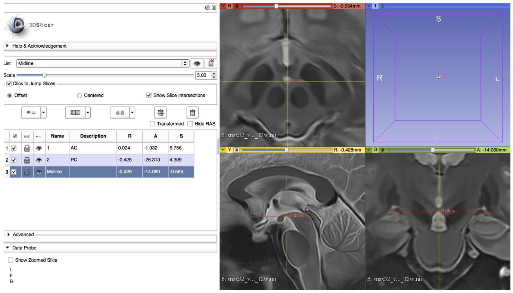

Next, you will perform the ACPC transform to realign the MRI volume. Under modules select **Registration>Specialized>ACPC Transform** (Left image below). Under the “ACPC transform” tab, select the “Parameter Set” dropdown tab and select “ACPC transform”. Below that is the “Transform Panel”. Under “ACPC Line” dropdown tab select “ACPC Line”, under “Midline” dropdown tab select “Midline”, and under “Output transform” dropdown tab select “New Linear Transform” and name it “Output Transform”. Next, click “Apply” at the bottom of the window (image below).

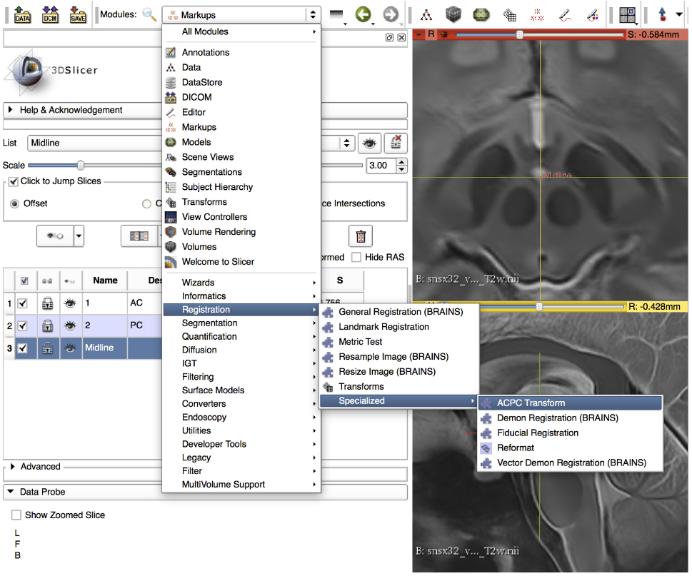

Finally, under “Modules” go to “Transforms.” Under the “Active Transform” dropdown tab select “Output Transform” as the active transform. Next, under the “Apply Transform” menu, Select all 4 lists (i.e the original loaded volume, ACPC Line, Midline etc.) and click the arrow pointing right to transfer them from “Transformable” to “Transformed.” Your image and fiducials should shift to realign with the proper orthogonal axis.

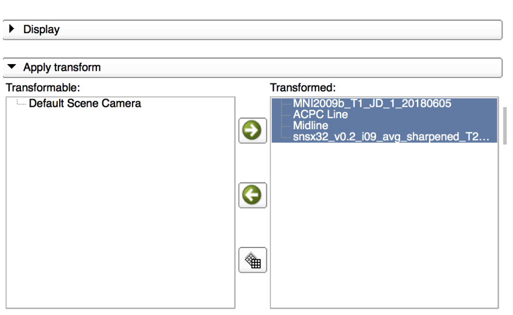

## General Fiducial Placement Strategies
Use the **"Jump to Slice"** feature to center your view on the fiducial of interest and ensure that the placed landmark appears accurate on all three standard views (axial, sagittal, coronal). Once a fiducial is placed, **dragging** the fiducial can allow for more refined placement. Holding down **shift** centers the view in all views on the cursor (use along with crosshair function). If a given fiducial is classified as **[midline]**, jump to an existing midline fiducial (e.g. AC or PC) and start by placing the fiducial on the **sagittal** view and refine placement using the other views. Try to place fiducials at the **boundary/edge** of the feature of interest. For some of the fiducials, the instructions for placement will explicitly say to place the landmark using information mostly from one view (e.g. axial view for olfactory sulcus). Be aware that changing the windowing of your images (and lighting in the room) may affect your perception of where landmarks should be placed. When you're satisfied with the location of a fiducial, **lock it in place** to prevent yourself from displacing it later. **NOTE: there is no UNDO feature for fiducial placements.**

## Placement of Fiducial Series
Create a new Markup list entitled **Fid32_[VolumeID]_[Rater]_[N]**. Click on **ACPC Line** and copy over AC and PC to your new list by right clicking each fiducial, choosing "Copy fiducial to another list", and selecting **Fid32_[VolumeID]_[Rater]_[N]**. Place the following **30 fiducials**, enter the number corresponding to the fiducial in the Name textbox and enter the underlined anatomical structure in the corresponding Description textbox:

## 1. AC [midline]

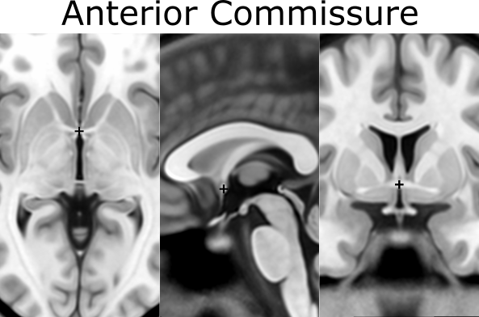

## 2. PC [midline]

## 3. infracollicular sulcus [midline]
  * inferior part of sulcus of inferior colliculi at the midline junction of inferior colliculi
  * Inferiormost boundary of longitudinal intercollicular sulcus

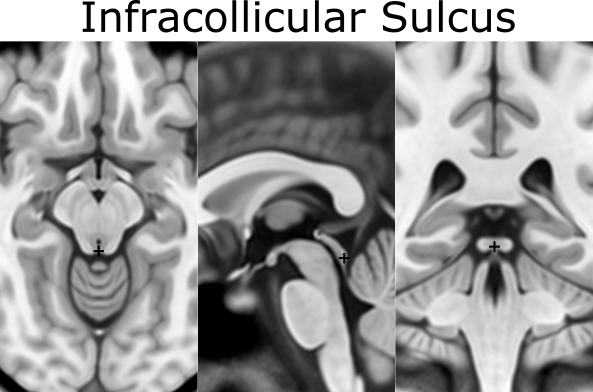
  
## 4. PMJ = pontomesencephalic junction [midline]
  * At the junction but because it doesn't end on a sharp point choose the ventral/inferior/pontine side of the junction using the sagittal and coronal views
  
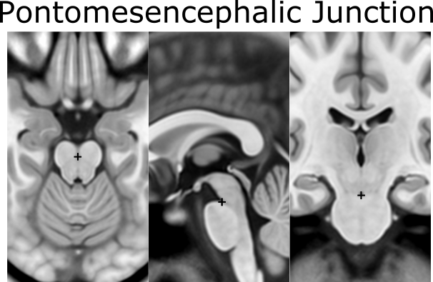
  
## 5. superior interpeduncular fossa [midline]
  * most superior axial slice
  * Use coronal slice to help optimize location at boundary of 3rd ventricle and surrounding brain
  * Commentary: nice landmark for DBS since subthalamic nucleus close by
  

  
## 6. R superior LMS = right superior lateral mesencephalic sulcus
  * Localize using axial slices; at boundary of CSF and brain
  

  
## 7. L superior LMS = left superior lateral mesencephalic sulcus (as in 6)

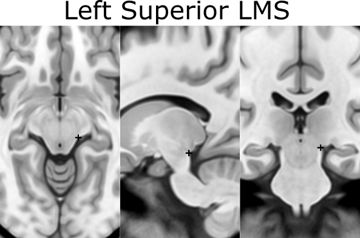

## 8. R inferior LMS = right inferior lateral mesencephalic sulcus
  * Localize at junction between midbrain and pons first using axial slices
  * Then refine positioning using sagittal view (at the change in angle of brainstem at the PMJ)
  

  
## 9. L inferior LMS = left inferior lateral mesencephalic sulcus (as in 8)

## 10. Culmen [midline]
  * most superior point of cerebellar vermis; one of the vermian lobules
  
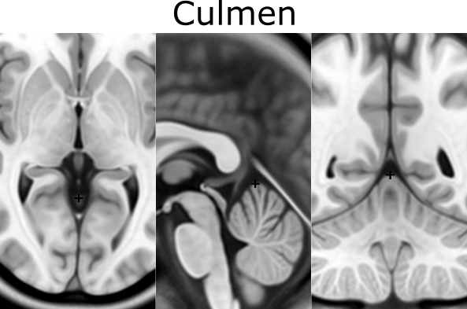
  
## 11. Intermammillary sulcus [midline]
  * Midpoint between the mamillary bodies

  
  
## 12. R MB = right mammillary body (center)

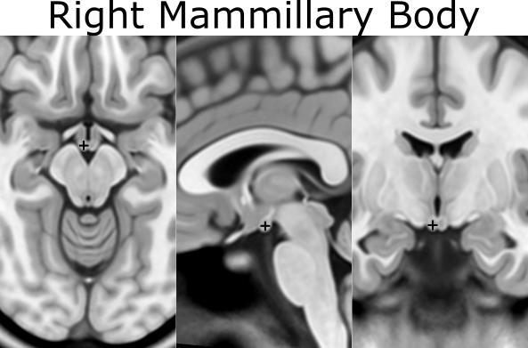

## 13. L MB = left mamillary body (center)

## 14. pineal gland [midline]

## 15. R LV at AC = right lateral aspect of frontal horn on coronal section of AC
  * Defined at same coronal slice as AC (jump to it)
  

  
## 16. L LV at AC = left lateral aspect of frontal horn on coronal section of AC (as in 15)

## 17. R LV at PC = right lateral aspect of frontal horn on coronal section of PC

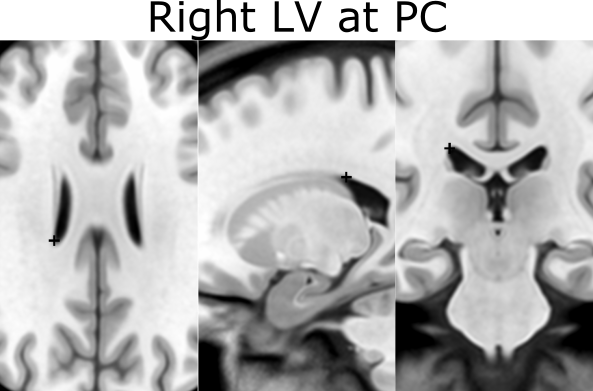

## 18. L LV at PC = left lateral aspect of frontal horn on coronal section of PC (as in 17)

## 19. Genu of CC = genu of corpus callosum [midline]
  * Place using sagittal view and optimizing as most anterior point on coronal slice
  

  
## 20. Splenium of CC = splenium of the corpus callosum [midline]
  * Place using sagittal view and optimize as inferiormost point on axial section
  
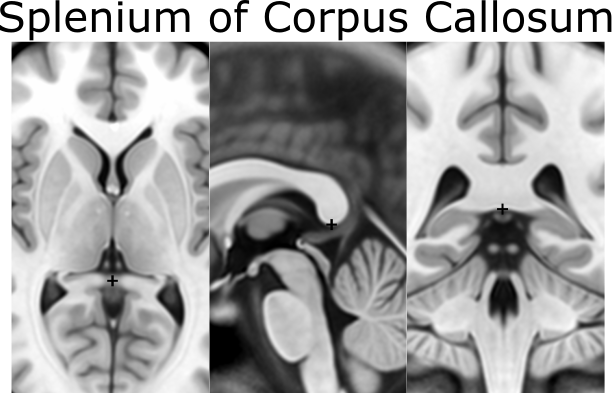
  
## 21. R AL temporal horn = right anterolateral temporal horn
  * Place using coronal view as anteriormost (and lateral) point of temporal horn
  * Choose a more ventral/inferior point on the coronal view
  * Place at the boundary of CSF and brain
  

  
## 22. L AL temporal horn = left anterolateral temporal horn (as in 21)

## 23. R superior AM temporal horn = Rhoton's R uncal recess
  * At the superior hippocampal-amygdalar transition area (HATA); NOTE: there is also an inferior anteromedial temporal horn
  * Rhoton's uncal recess: "narrow medially projecting space between hippocampal head & ventricular surface of amygdala located lateral to uncal apex")
  * Place at the boundary of CSF and brain
  

  
## 24. L superior AM temporal horn = Rhoton's L uncal recess (as in 23)

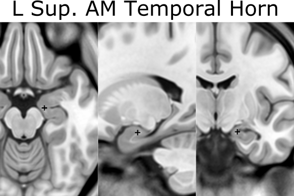

## 25. R inferior AM temporal horn
  * Initially place using coronal view
  
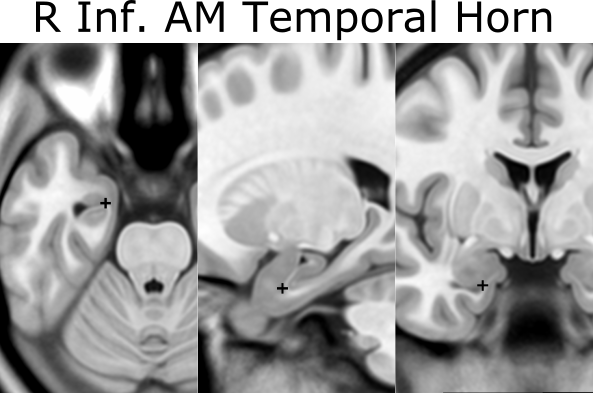
  
## 26. L inferior AM temporal horn (as in 25)

## 27. R indusium griseum origin
  * Defined on sagittal slice at takeoff from posterior hippocampus below splenium
  

  
## 28. L indusium griseum origin (as in 27)

## 29. R ventral occipital horn
  * Defined on ventral/inferior portion of last visible coronal slice with occipital horn
  * Optimize using other views
  
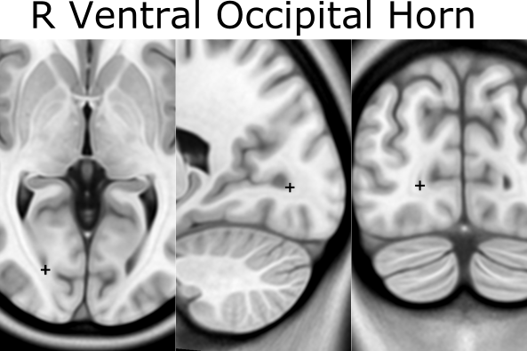
  
## 30. L ventral occipital horn (as in 29)

## 31. R olfactory sulcal fundus
  * Sulcal fundus = at depth of sulcus and boundary of gray matter-white matter
  * Posterior and most superior portion visible on axial slice

  
## 32. L olfactory sulcal fundus (as in 31)

Save the fiducial file (.fcsv) locally.

## Resources:
* Tutorial given as part of Brainhack Western 2018: https://www.youtube.com/watch?v=huGtd19_uiM
* Git repository for BHG18 tutorial results: https://github.com/jclauneuro/BHG18_landmarkprotocol/
